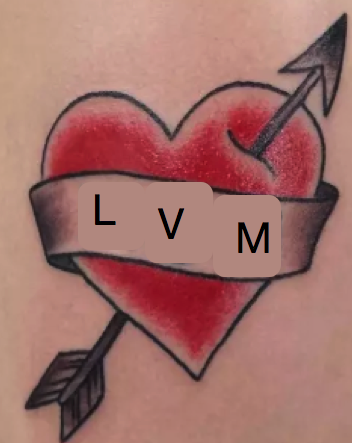

# iLVMymAMI

Notes and scripts for repartitioning a volume with LVM from an existing marketplace AMI.



## Background and Approach
On \*Nix based systems it is generally considered best practice to create separate partitions for `/var` and `/home` so that they are isolated from `/`. This has the advantage of preventing a rogue user from filling up the root volume with large files and crashing the system or a rogue process filling up `/var/log` and causing issues with processes that need to modify the root filesystem. Some would argue even further isolation via `/var/log` and `/tmp`. It all depends on your use case. More discussion on the topic can be found [here](https://access.redhat.com/discussions/641923). 

Additionally, it's nice to have the main mount points of your system running on LVM so that the filesystems can grow and shrink as needed. This is also a very opinionated way to setup a base operating system disk and some would argue it's becoming less relevant as we move towards cloud and virtualization.

However, for our use cases I believe that we need to keep `/var` and `/home` isolated from `/` and if we have to do that anyway we might as well do it with LVM so we have filesystem flexibility later. Therefore, this guide covers the method of taking an AWS Marketplace AMI and re-partitioning it as LVM and registering it as a new AMI. 

## Automatic Image Creation
If you want to just take an existing CentOS AMI and create an LVM version of it you can try using the script provided here. 

Create a config file using `config-sample.yml` as a template and then run:

```
python ilvmymami.py config.yml
```

The script will attempt the following:
1. create an instance with an additional volume with `parter-centos.sh` as userdata
1. the userdata will attempt to prepare the additional volume as LVM and clone the builder instance's root volume to it and then shut down
1. the script will then attempt to snapshot and register the volume as an AMI using tags you provide in the config file.

Hopefully the above will work for you however it may be finicky. Below is an overview of the manual steps for the process. 

# Manual Run
## Prereqs

1. Launch an `m5` class instance from desired source AMI. In this case we'll use a CentOS image from the marketplace that's been lightly modified (patched and user updated)
1. Shut down the instance once it's launched.
1. Create a new blank volume and attach it to the instance you just launched as `/dev/sdf`
   * NOTE: Make sure the volume is in the same AZ as the instance you just created
1. Start the instance and SSH to it.

## Steps
This will be a walkthrough of the steps in the `parter-centos.sh` script.

#### Partition the New Drive
1. First switch to root with `sudo su -`
1. Run `fdisk -l` and find out what your new device name is. In my case it was `/dev/nvme1n1`. 
1. Run `fdisk /dev/nvme1n1` to start partitioning the new attached volume.
1. First set the drive as `msdos` mode by hitting `o`. The alternative is `gpt` which isn't covered in this guide.
1. Hit `n` to create a new partition.
1. Set it as partition 1 and hit Enter to accept the default start position.
1. For the end position instead of using a sector we'll just say `+500M` to set a 500 MB partition.
1. Make another new partition by hitting `n` and making it partition 2. Just hit enter twice in a row to have this one fill the remaining space on the drive.
1. Now set the partition type to `Linux LVM` by hitting `t`, selecting partition 2, and setting the type code as `8e`
1. Make partition 1 bootable by hitting `a` and selecting partition 1.
1. You can print the results of the table by hitting `p`. (see sample output below)
1. Write the partition table with `w` and then hit `q` to exit the partitioner.

Sample partition table
```
Disk /dev/nvme0n1: 53.7 GB, 53687091200 bytes, 104857600 sectors
Units = sectors of 1 * 512 = 512 bytes
Sector size (logical/physical): 512 bytes / 512 bytes
I/O size (minimum/optimal): 512 bytes / 512 bytes
Disk label type: dos
Disk identifier: 0x61cdaa0a

        Device Boot      Start         End      Blocks   Id  System
/dev/nvme0n1p1   *        2048     1026047      512000   83  Linux
/dev/nvme0n1p2         1026048    16777215     7875584   8e  Linux LVM
```

#### Setup LVM on the New Drive
Here we'll carve out the LVM partition with our desired partitions for `/home`, `/var`, and `/`.

1. Make sure you have LVM utilities installed by running `yum install lvm2 -y`
1. Set your LVM partition to be a "physical" volume for LVM to use by running `pvcreate /dev/nvme0n1p2`
1. Now add that PV as part of a new volume group by running `vgcreate vg1 /dev/nvme0n1p2`
   * You don't have to use `vg1` as the name. You can name your volume group anything you like.
1. Now we can set up our logical volumes with names and specific sizes. You can set hard sizes (e.g., 10GB) but in this example I'm going to set the logical volumes up as percentages of free space on the total volume group.
   1. `lvcreate -l 30%VG -n root vg1`
   1. `lvcreate -l 40%VG -n var vg1`
   1. `lvcreate -l 30%VG -n home vg1`
1. Now we'll make the filesystems on the boot volume and the new logical volumes. In this example we'll use xfs. If you wan tto use ext4 or something that's fine but some of the later commands will be different. 
   1. `mkfs.xfs /dev/nvme0n1p1 -L /boot`
      * NOTE: Make sure you add the filesystem on the first partition that we're using for boot and not the second that we're using for LVM. 
   1. `mkfs.xfs /dev/vg1/root -L /`
      * Some systems honor the "label" on the filesystem so it's nice to add. 
   1. `mkfs.xfs /dev/vg1/var`
   1. `mkfs.xfs /dev/vg1/home`

That should be it for partitioning and filesystem creation. Now we'll move on to cloning the host OS to the new volume. 

#### Cloning the OS to the New Drive
Now we'll work on setting up the new drive as an operating system disk with all the proper files and MBR that it needs to boot on it's own. 

1. First create your mount points and start mounting the logical volumes to these mount point so we can start interacting with the filesystem.
   1. `mkdir -p /mnt`
   1. `mount /dev/vg1/root /mnt`
   1. `mkdir -p /mnt/var`
   1. `mount /dev/vg1/var /mnt/var`
   1. `mkdir -p /mnt/home`
   1. `mount /dev/vg1/home /mnt/home`
   1. `mkdir -p /mnt/boot`
   1. `mount /dev/nvme0n1p1 /mnt/boot`
1. Now we're going to copy over all our files from the host operating system to the new drive. We'll use the `rsync` command to do this and we'll make sure to exclude some special paths such as `/dev` and our own `/mnt` point!
   1. `rsync -axHAX --exclude='{"/dev/*","/proc/*","/sys/*","/tmp/*","/run/*","/mnt/*","/media/*","/srv/*","/newsysroot"}' / /mnt/`
1. Now that we have the raw files on disk we need to prepare the target volume so that we can jump into it with `chroot` and use some executables on the new system to build our bootloader image and run grub to install the MBR on the new disk. We'll start by mapping some important paths from the host operating system. These are not normal mounts, they're bind mounts to the host. These will give the environment living on the "guest" disk access to devices on the host. 
   1. `mkdir -p /mnt/proc`
   1. `mount -o bind /proc /mnt/proc`
   1. `mkdir -p /mnt/sys`
   1. `mount -o bind /sys /mnt/sys`
   1. `mkdir -p /mnt/dev`
   1. `mount -o bind /dev /mnt/dev`
1. Now we need to "jump into" the new OS environment by running `chroot`. From there we'll run some commands as if we're booted into the OS on that volume. 
   1. Run `chroot /mnt`
   1. Run `dracut -f -v` to build a new bootloader image. dracut will automatically install this to `/boot` for you.
   1. Run `grub2-mkconfig -o /boot/grub2/grub.cfg` to build a new grub bootloader config. Grub will automatically install this to `/boot` for you. 
   1. Run `grub2-install /dev/nvme0n1` to have grub build your MBR for you. Make sure it's going to the base volume and not a partition. This is a very important step. 
1. Now we can exit out of the chroot environment by running `exit`
1. Now we can build out the `/etc/fstab` file on the guest disk so that all of the proper logical volumes get mounted to the right places when the disk boots.
1. Edit the fstab file by running your favorite editor on it like `vi /mnt/etc/fstab`. You'll need to make sure you an entry for all of your volumes: `/`, `/boot`, `/var`, and `/home`. The UUID for each has to match what the volume has listed for UUID's. You can see the UUIDs for your volumes by running the `blkid` command and taking note of them. Make your `/mnt/etc/fstab` look like the one in the below example. 
   * For example, the root mount point is found by looking up the UUID for the `/dev/mapper/vg1-root` device from the blkid output. Take that UUID and make a corresponding root mount in fstab
      * `UUID=29c5a90e-eb83-4f16-8756-0787245d541e /                       xfs     defaults        0 0`
   * Repeat for the other 3 volumes.
1. CentOS 7 comes with SELinux in Enforcing mode by default, so AWS suggeste adding /.autorelabel file to relabel all files upon reboot (you can disregard this step if SELinux is not active)
   1. `touch /.autorelabel`
1. Now unmount everything by running `mount -R /mnt` followed by `vgchange -an vg1` and shutdown with `shutdown -h now`

Example output from `blkid` command:
```
[gecloud@ip-10-230-204-134 ~]$ blkid
/dev/nvme0n1p1: LABEL="/boot" UUID="f296f0ec-6c85-4d54-a6f6-ba6500a70e8a" TYPE="xfs"
/dev/nvme0n1p2: UUID="FzqWs7-RGYD-uVky-BfMc-89xb-sTWm-aowMQ0" TYPE="LVM2_member"
/dev/mapper/vg1-root: LABEL="/" UUID="29c5a90e-eb83-4f16-8756-0787245d541e" TYPE="xfs"
/dev/mapper/vg1-var: UUID="74cbe4b7-5c7d-4583-8298-0fd9b17fd2fc" TYPE="xfs"
/dev/mapper/vg1-home: UUID="5274a520-44a1-4b76-ae11-33c19cb4bbbd" TYPE="xfs"
```

Example `/mnt/etc/fstab` file:
```
UUID=29c5a90e-eb83-4f16-8756-0787245d541e /                       xfs     defaults        0 0
UUID=5274a520-44a1-4b76-ae11-33c19cb4bbbd /home                       xfs     defaults        0 0
UUID=74cbe4b7-5c7d-4583-8298-0fd9b17fd2fc /var                       xfs     defaults        0 0
UUID=f296f0ec-6c85-4d54-a6f6-ba6500a70e8a /boot                       xfs     defaults        0 0
```

#### Test the New Volume
Now we have what we think is a working volume. Let's launch an instance and test. If you already know it works and just want to create an AMI just skip this and go to the "Make an AMI" section below.

1. Go to the AWS EC2 console find your builder instance from the above steps and detach your new volume that you've been working on so diligently. Now your volume is a free agent that can be attached to any instance. 
1. Launch a new instance from any AMI you choose. It won't really matter since we're going to detach whatever root volume it has anyway. 
1. Once the instance is launched, shut it down and detach the root volume. 
1. Now attach your other LVM partitioned volume to the new instance and make sure to map it to the `/dev/sda1` device. This is important as it lets AWS know you want to use this volume as the root or boot volume. 
1. Start the new instance.
1. If everything worked properly you should be able to SSH to the new instance and see that you're operating on an LVM disk now!

Output of `df -h`:
```
[gecloud@ip-10-230-204-134 ~]$ df -h
Filesystem            Size  Used Avail Use% Mounted on
/dev/mapper/vg1-root   15G  957M   14G   7% /
devtmpfs              3.7G     0  3.7G   0% /dev
tmpfs                 3.7G     0  3.7G   0% /dev/shm
tmpfs                 3.7G   17M  3.7G   1% /run
tmpfs                 3.7G     0  3.7G   0% /sys/fs/cgroup
/dev/mapper/vg1-home   15G   34M   15G   1% /home
/dev/mapper/vg1-var    20G  170M   20G   1% /var
/dev/nvme0n1p1        497M  228M  270M  46% /boot
tmpfs                 753M     0  753M   0% /run/user/1001
```

#### Make an AMI
Now you can take your new volume and use to to make an AMI so you can mass produce your work.

1. Perform the same steps yo did above but this time skip the "Test the New Volume"  section. 
1. Find your volume in the console and right click and "Create Snapshot". You can give it a description or tags if you want.
1. Once the snapshot is done creating find it in the Snapshots console. Right click on it and select "Create Image". Use the following options:
   * Architecture: `x86_64`
   * Root device name: `/dev/sda1`
   * Virtualization Type: `Hardware-assisted virtualization`
1. Add whatever name and description you want and click "Create". You can add more tags later. 
1. Once the image is registered try and use it to launch a new instance.

NOTE: If you launched the instance with a drive larger than th eroot volume specified in the AMI then the normal cloud-init process that usually resizes the disk won't work with LVM. You'll have to expand the filesystem manually. Check out the example script in `samples/vgextender.sh`. You could run this as part of the userdata process or something.


## Credit
Thanks to Alex Y from AWS support for helping with some blockers in this process.


TODO: Add some sysprep steps suggested by [Bob Plankers](https://lonesysadmin.net/2013/03/26/preparing-linux-template-vms/).
TODO: Add a [fhid](https://github.com/GESkunkworks/fhid) POST at the end of the auto script so we get image registration from this "out of band" image creation process.
